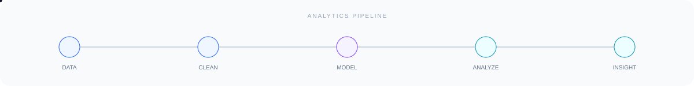

<picture>
  <source media="(prefers-color-scheme: dark)" srcset="./assets/hero-dark-v2.svg">
  <source media="(prefers-color-scheme: light)" srcset="./assets/hero-light-v2.svg">
  
</picture>

 

---

## 👋 About Me

**Data Analyst with a Market Research background**, focused on turning structured and survey data into clear, decision-ready insights.

I bring **1.3 years of hands-on Market Research Analytics experience** in survey data processing, validation, consumer insights and analytical reporting, while building portfolio projects in **SQL Server, Power BI, DAX and data modeling**.

> **Current direction:** Data Analytics → Business Intelligence → Consumer & Market Insights

| Area | Focus |
|---|---|
| 🔎 Data Analysis | SQL, Excel, data validation, analytical problem solving |
| 📊 Business Intelligence | Power BI, DAX, Power Query, data modeling |
| 🧱 Data Engineering Foundations | SQL Server, ETL concepts, Medallion Architecture |
| 🧠 Consumer Insights | Survey analytics, brand health, consumer preferences |

---

## 🔄 My Analytics Workflow

`RAW DATA` → `CLEAN` → `TRANSFORM` → `MODEL` → `ANALYZE` → `VISUALIZE` → `INSIGHT`

---

## 🚀 Featured Projects

### 01 · SQL Data Warehouse & Analytics

**SQL Server · Medallion Architecture · Advanced SQL · Analytics**

A portfolio data warehouse built around a **Bronze → Silver → Gold** architecture, followed by analytical SQL for business questions.

**Pipeline:** `CSV / Source Data` → `Bronze` → `Silver` → `Gold` → `Analytics`

- Data loading and validation
- Cleaning and standardization across Silver tables
- CTEs, joins, aggregations and window functions
- Customer, product, trend, ranking and segmentation analysis
- KPI-oriented analytical views

### 02 · Consumer Insights & Market Research Analytics

**Power BI · Power Query · Star Schema · DAX · Survey Analytics**

An interactive consumer insights report built from survey-style data, combining data preparation, dimensional modeling and business-focused analysis.

**Pipeline:** `Survey Data` → `Power Query` → `Star Schema` → `DAX` → `Power BI` → `Insights`

- Survey data preparation and transformation
- Fact and dimension modeling
- DAX measures and Field Parameters
- Consumer preferences and product attributes
- Purchase intent and Price Sensitivity Meter analysis

---

## 🧰 Technology Stack

### Core Analytics

     

### Data & BI Practices

      

### Market Research & Statistics

      

---

## 📚 Currently Learning

- **Python for Data Analysis** — Python, NumPy, Pandas, cleaning, transformation, visualization and EDA
- **Advanced SQL & Data Analysis** — analytical SQL and SQL Server workflows
- **Power BI & DAX** — modeling, measures, context and interactive reporting
- **Statistics for Data Analysis** — practical statistical thinking for business and research data

---

## 🎯 What I'm Looking For

**Data Analyst · BI Analyst · Reporting Analyst · Consumer Insights Analyst · Market Research Analyst**

Interested in roles where **data preparation + analysis + visualization + business context** come together.

---

## 🤝 Let's Connect

&nbsp;&nbsp;
&nbsp;&nbsp;
&nbsp;&nbsp;

 

  
<picture>
  <source media="(prefers-color-scheme: dark)" srcset="./assets/pipeline-dark-v2.svg">
  <source media="(prefers-color-scheme: light)" srcset="./assets/pipeline-light-v2.svg">
  
</picture>

